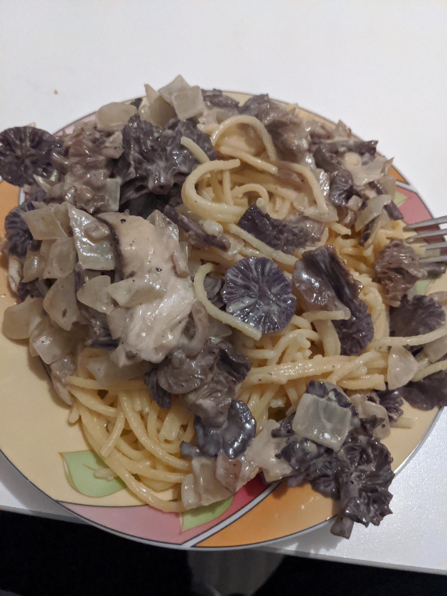

Rezepte
===

### Spaghetti mit Parasolpilz und Lacktrichterlingen
> Datum: 31.10.2023; Ort: Lindau

<!--  -->

#### Zutaten
- Spaghetti
- Kochcreme
- Olivenöl
- zwei Zwiebeln
- Pilze
  - Lacktrichterling [rot](wiki/Pilze/Roter_Lacktrichterling.md) und/oder [violett](wiki/Pilze/Violetter_Lacktrichterling.md)
  - [Parasol](wiki/Pilze/Parasolpilz.md)
- Gewürze:
  - Salz
  - Pfeffer

#### Zubereitung
Nudeln mit in gesalzenem Wasser gar kochen. Pilze putzen und schneiden. Zwiebeln in Öl glasig schwitzen und dann Pilze hinzugeben. Wenn Pilze nicht mehr an Größe verlieren die Temperatur verringern und die Kochcreme hinzugeben und unterrühren. Nudeln und Pilzsauce zusammen servieren.

### nächstes Rezept